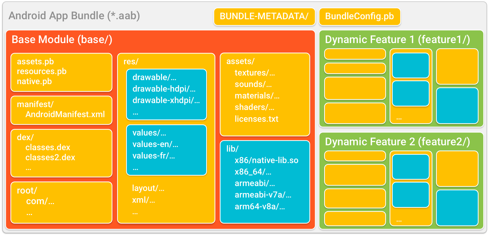
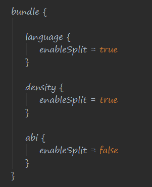
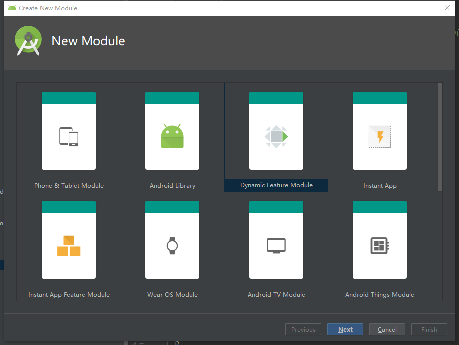
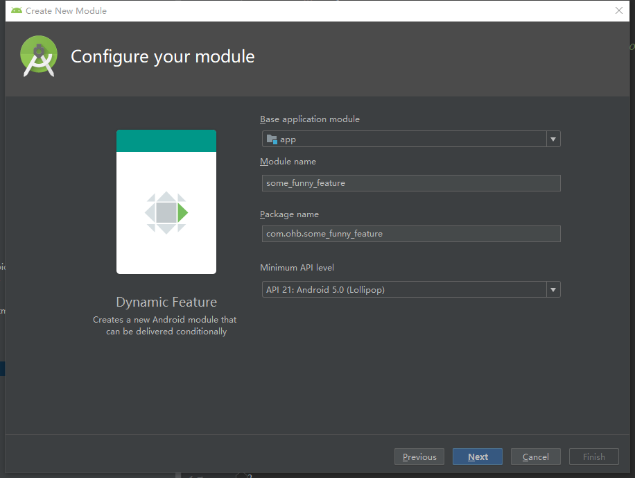
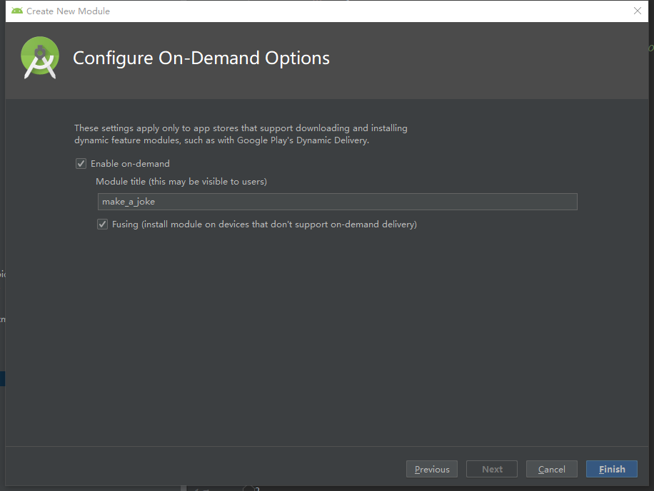
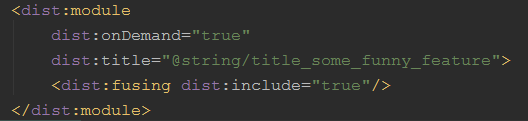
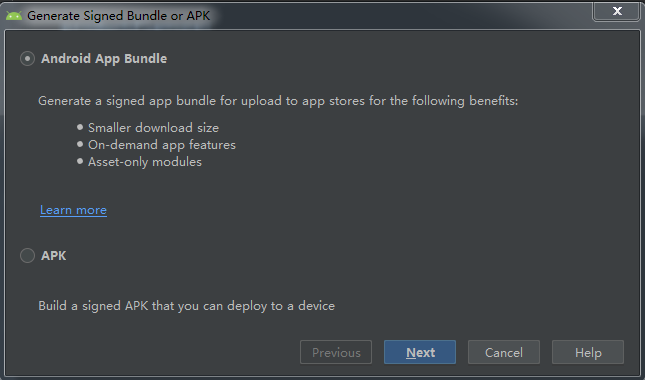
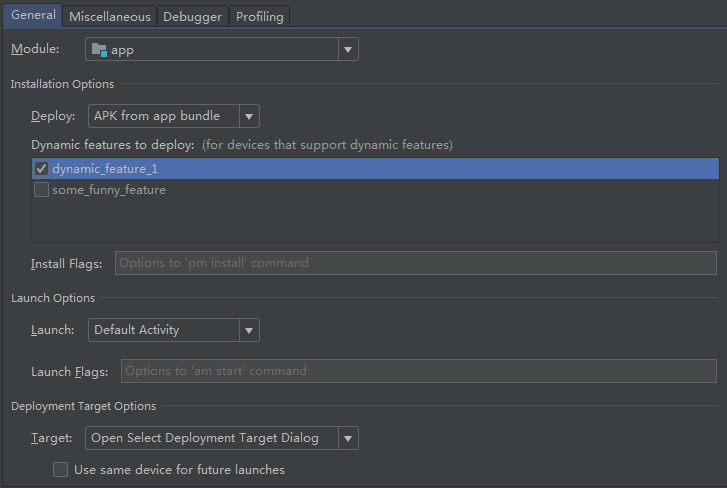

# Android App Bundle初步调研报告
***
## Android App Bundle简介及其优势
Android App Bundle是一个新的应用上传格式，它允许开发者将应用按照自己所支持的屏幕密度，地区语言，ABI以及各种功能feature进行细粒度的划分，使得用户可以按需下载应用的不同部分，从而减少应用的体积大小。
### Dynamic Delivery介绍
一种新的基于.aab文件格式的应用分发模型。在这种模型下，**由Google Play使用.aab文件中的代码和资源** 来为用户生成特定于设备的屏幕密度，ABI以及地区语言的应用程序（APK文件）以及动态特性APK文件。并且如果开发者提供了动态特性的话，用户可以在第一次使用该特性的时候再下载动态特性apk文件，避免在第一次安装的时候就下载整个应用程序的代码和资源。
#### Base APK
这是用户第一次下载应用的时候需要下载的基础APK文件。它包含了应用程序最基本功能的代码和资源，其中的代码和资源可能被以后下载的动态特性apk中的代码所引用。Base APK的manifest文件中声明了整个应用程序（包括可能会有的dynamic feature apks）中所需要的四大组件，并且包含了应用程序的版本控制以及所有的权限声明。这个APK文件中的代码和资源全部来自我们工程中的app module(或者叫base module)。此APK文件由Google Play从我们提供的.aab文件中生成。

#### Dynamic feature APKs
动态特性APK。每一个这样的APK文件提供了所对应的动态特性所需要的代码和资源（也有可能会依赖Base APK中的代码和资源）。动态特性需要我们在IDE中显示地创建一个dynamic feature module，每一个这样的module都有自己的manifest文件，并且提供了对应功能的代码和资源。与Base APK同样地，当上传到Google Play之后，Google Play会从.aab文件中为每一个dynamic feature module分别生成一个dynamic feature apk
#### Configuration APKs
在以往每次下载应用程序的时候，无论用户的设备是什么配置，都会把应用程序针对所有配置的资源全部下载到设备上，造成了很多空间的浪费。在Dynamic Delivery下，Google Play从.aab文件中对每一种资源分别针对不同的设备配置都生成一个apk文件。比如对于drawable资源，针对不同的屏幕密度生成一系列的apk文件，每一个apk文件都包含了某一种屏幕密度下的所有drawable资源，叫做Density Configuration Split APKs。同理，对于ABI和Language都是一样的操作，分别叫做ABI Configuration Split APKs和Language Configuration APKs。当用户第一次下载应用的时候，除了下载一个Base APK文件以外，Goole play会根据用户设备的配置，分别从三个Split APKs中选择一个对应于设备配置的apk组成一个Configuration APKs。对于Base APK叫做Base Configuration APKs，对于Dynamic Feature APKs叫做Feature Configuration APKs。当用户切换了语言之后，会自动从Google Play下载一个新的Language Configuration APK。
#### Android App Bundle文件格式

这是一个支持多个设备配置和两个动态特性的.aab文件。
- base/,feature1/,feature2/：分别代表了工程中的base module(app module)以及各个dynamic feature module。每个dynamic feature module的名字分别在各自的manifest文件中指定。
- BUNDLE-METADATA/：包含了提供给Google Play或者bundletool的一些信息用于生成APK文件。这些信息包括但不限于ProGuard映射表，完整的.dex文件列表等。这个文件的内容不会出现在最终下发给用户的APK文件中。
- Module Protocol Buffer(*.pb) files：这些文件包含的信息用来向Google Play描述每个module中的内容。如BundleConfig.pb文件中包含了我们使用的bundletool的版本信息等；native.pb和resources.pb文件包含了对各自module中的资源和代码的描述信息用于帮助Google Play对我们的APK文件针对不同设备配置进行优化。
- manifest/：各自module的manifest文件。
- dex/:各自module的.dex文件。
- res/,lib/,assets/：和普通APK文件中的res,lib,assets目录一样。
- root/：这个文件夹下的文件包含了一些基于Java的资源，在生成APK的时候会重新定位到APK的根目录下。


## 构建一个Android App Bundle
### Base Module
在开始之前需要将Android Studio升级到3.2或者以上。如果你不需要使用Dynamic Feature的话那么只需要很少的工作就可以很好的适配Google Play的Dynamic Delivery模型。在构建app bundle的时候，base module就是你的app module（准确的说是声明了"apply plugin:'com.android.application'"的module）。此外，对整个app bundle的签名是使用的在base module中提供的签名信息。并且，版本信息也是在base module中指定的。

### Manifest of Base Module
Google Play生成base apk的时候会把工程中所有module的manifest文件合并到base apk中。

### Build Configuration of Base Module
- Code Shrinking：base module中的minifyEnabled的标志会控制整个app bundle的代码混淆。如果项目中的dynamic feature module也指定了这个标志，会在构建起见被忽略掉。但是可以在dynamic feature module中指定自定义的proguard rules文件。
- splits block：build.gradle文件中的splits block会在构建期间被忽略。不过可以使用bundle block来指定哪些资源配置项应该包含在configuration apks中。比如：  
  
上图的配置表示在language和density维度上按照app bundle支持的所有语言和屏幕密度分别生成不同的configuration apks，但是在abi这个维度上不在单独生成apk文件，而是全部打包在base apk或者dynamic feature apk中。

### Manage app updates
开发者不用单独管理每个dynamic feature apk的版本，只需要在每次升级的时候在build.gradle文件中指定版本号和版本名，就像常规app一样。当你更新了你工程中的代码之后，你需要更新base module中的版本信息，然后构建一个全新的app bundle，再上传到Google Play，Google Play会基于新的app bunlde生成全新的一套APKs，如果一位之前安装过你的app的用户更新应用程序，那么他设备上所有安装过的APKs都会被替换成最新的APKs

### Build Dynamic Feature Modules
1. 通过菜单栏创建一个Dynamic Feature Module.  
  
2. 配置自己的Dynamic Feature Modules.    
  
  + Base application module就是我们的base module，直接默认的就是app module.
  + 第二行的输入框指定一个module name。Specify a Module name.IDE使用这个名字来把这个dynamic feature module标识为子工程。在构建app bundle的时候，Gradle会在这个module的manifest文件中的<manifest split>特性中注入我们指定的module name.
  + 第三行的输入框指定这个dynamic feature module的包名
  + 第四行中指定的最低API级别要和base module中的一致。  
3. 配置On-Demand选项。  
  
  + 选中第一个On-Demand复选框，表示这个dynamic feature apk只有当用户需要的时候才会进行下载，并且在下载之前会先向用户进行确认；如果没有选中第一个复选框，则第二个Fusing将置灰不可用，并且这个dynamic feature apk将在第一次下载app的时候下发到用户的设备。
  + 在后面的文本框中输入的名字将作为向用户展示的dynamic feature apk的名字，用户使用这个名字来辨认这个dynamic feature apk。
  + 第二个复选框只有当第一个复选框被选中之后才可以被选择。如果用户的设备上的系统版本在API 21以下，则系统不会支持Dynamic Delivery。当用户选中了第一个复选框，在这个时候，如果Fusing这个复选框被选中，就表示这个dynamic feature module会和base module一起打包在初始的一套APK文件中，并且随着用户第一次安装app就下发到设备而不是当用户第一次使用到这个dynamic feature module的功能时才触发下载对应的dynamic feature apk文件；如果Fusing这个复选框没有被选中，则表示这个dynamic feature module不会和base module一起被打包在最初生成的一套APK文件中，也不会在第一次下载app的时候被下发到设备上，并且以后也不会下发到设备上.  
  + On-Demand和Fusing这两个选项将会体现在dynamic feature module的manifest文件配置中。不需要我们手动配置，IDE会自动为我们在manifest中注入以下两个特性：  
    
  中间的title属性表示我们之前创建dynamic feature module的时候设置的Module Title  
4. 在以上操作完成后IDE会在base module的build.gradle文件中添加一下配置使得base module知道dynamic feature module的存在：  
```Groovy
android {
  ...
dynamicFeatures = [":dynamic_feature_1", ":some_funny_feature"]
}
```
并且在dynamic feature module的build.gradle文件中添加以下配置分别表示应用dynamic-feature的gradle插件以及对base module的依赖:  
```Groovy
apply plugin: 'com.android.dynamic-feature'
```
```Groovy
dependencies {
    ...
    implementation project(':app')
}
```
还可以对dynamic feature module添加proguard rules文件指定自己的混淆规则：  
```Groovy
android.buildTypes {
     ...
     release {
         ...
         proguardFiles 'proguard-rules-dynamic-features.pro'
     }
}
```

### 从Android App Bundle部署，测试应用程序
添加了对Dynamic Delivery的支持之后，我们可以从本地来测试我们的app bundle。
 1. 如果我们从IDE来部署我们的app，首先要生成一个app bundle。我们在Andorid Studio的Build下拉菜单中选择Generate Signed Bundle/APK，然后在弹出的对话框中选中Android App Bundle单选框：  
   
 点击Next之后对app bundle进行签名就和以前普通app的流程一样，然后我们就可以得到一个.aab格式的app bundle文件  

 2. 得到.aab文件后就可以开始我们的部署流程。和普通的app没有太大的区别。只需要在Select Run/Debug  Configuration菜单中做出如下配置：  
   
 Deploy旁边的下拉框选择"APK from app bundle"，表示我们的APK由app bundle文件生成。在下面的Dynamic features to deploy中选择你这次部署app需要打包进去的dynamic feature module，如果都不选的话就需要在运行时，第一次使用的时候去下载，这种情况在本地无法模拟，需要将app bundle上传到Google Play,并加入Play Console的Internal Test Track才能测试


### 使用bundletool在本地测试应用
不管是Gradle,Android Studio还是Google Play都是使用bundletool来构建一个app bundle或者从app bundle中生成各种APK文件。  
 1. 首先我们要下载[bundletool](https://github.com/google/bundletool/releases)
 2. 使用以下命令可以生成一套未签名的APKs
 ```bash
 bundletool build-apks --bundle=.../my_app.aab --output=.../my_app.apks
 ```
 3. 如果要生成一套签名的APKs使用如下命令：
 ```bash
 bundletool build-apks --bundle=.../my_app.aab --output=.../my_app.apks --ks=.../keystore.jks --ks-pass=password:xxxxxx --ks-key-alias=MyKeyAlias --key-pass=file:.../pwfile.pw --device-spec=spec_json
 ```
 跟普通app的签名其实差不太多。其中```--ks-pass```和```--key-pass```的值可以用字面值或者文件指定，分别加上```password:```和```file:```前缀就可以。```--device-spec```这个参数可以指定一个包含了设备的配置数据的json文件，使得bundletoole可以针对特定的设备生成特定的configuration apks。如果没有指定这个flag的话，我们可以加上```--connected-device```这个flag来让bundletool生成针对当前连接设备的configuration apks。如果这两个flag都没有指定的话，bundletool就会为你的应用程序能支持的所有配置的设备生成全量的APKs。
